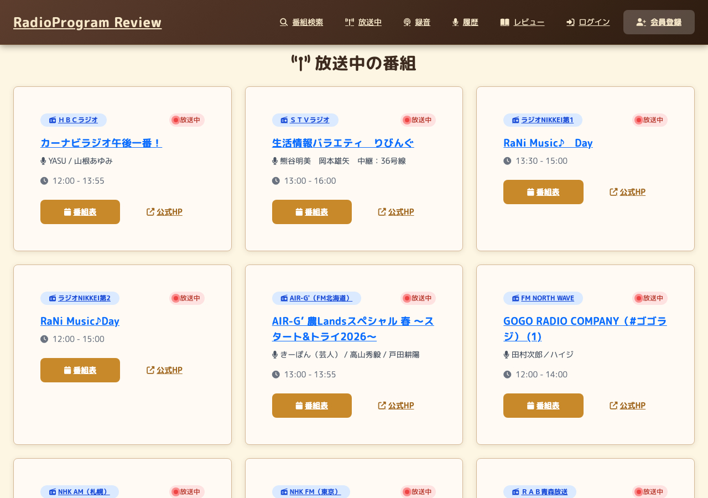
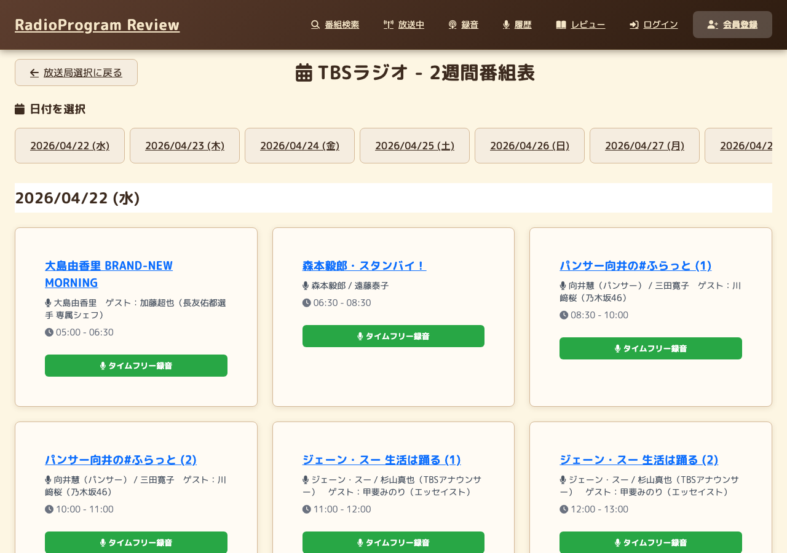

# RadioProgram Review (Go)

Radiko APIと連携するラジオ番組レビューWebアプリケーション。  
PHP/Laravel版（`../radio_review/`）をGoで書き直したもの。

## スクリーンショット

| 放送中の番組 | 2週間番組表（タイムフリー） |
|---|---|
|  |  |

## 主な機能

- 放送中番組の一覧表示（Radiko APIリアルタイム取得）
- 週次・2週間番組表の表示
- 番組詳細・レビュー投稿・レビュー閲覧
- お気に入り番組登録（帯番組の曜日管理対応）
- タイムフリー録音（HLS並列ダウンロード、FFmpegでAAC変換）
- 録音スケジュール管理
- ユーザー認証（登録・ログイン・パスワードリセット）
- PWA対応（Service Worker、オフラインページ）

## 技術スタック

| 領域 | 技術 |
|---|---|
| 言語 | Go 1.22+ |
| ルーター | Chi v5 |
| テンプレート | html/template（標準ライブラリ） |
| DB | MySQL 8.0 + sqlx |
| キャッシュ/セッション | Redis + go-redis |
| 認証 | gorilla/sessions + bcrypt |
| 音声処理 | FFmpeg（os/exec） |
| 設定 | godotenv |
| インフラ | Docker / Docker Compose |

## ディレクトリ構成

```
radio_review_go/
├── cmd/
│   ├── server/main.go      # エントリポイント・ルーティング
│   └── batch/main.go       # バッチ処理
├── internal/
│   ├── handler/            # HTTPハンドラー
│   ├── service/            # ビジネスロジック
│   ├── repository/         # DB操作
│   ├── middleware/         # 認証・CSP・レートリミット
│   ├── job/                # 非同期ジョブ（録音など）
│   └── model/              # 構造体定義
├── pkg/
│   └── radiko/
│       ├── client.go       # Radiko認証・API
│       └── hls.go          # HLSセグメント並列ダウンロード
├── web/
│   ├── templates/          # html/templateファイル
│   └── static/             # CSS・JS・PWAアイコン・SW
├── migrations/             # MySQLスキーマ（Docker起動時に自動適用）
├── docker/
│   └── mysql/my.cnf
├── docker-compose.yml
└── Dockerfile
```

## セットアップ

### Docker（推奨）

```bash
# .envを作成
cp .env.example .env  # なければ下記「環境変数」を参考に手動作成

# Radiko認証キーを配置（タイムフリー録音に必須・下記「Radiko認証キー」参照）
# storage/keys/radiko_auth_key.txt

# 起動（MySQL・Redis・アプリを一括起動）
docker compose up -d

# ブラウザで確認
open http://localhost:8080
```

### ローカル（Go直実行）

前提: Go 1.22+、MySQL 8.0、Redis、FFmpegがインストール済みであること。

```bash
# 依存関係インストール
go mod download

# DBスキーマ適用（初回のみ）
mysql -u <user> -p <database> < migrations/001_initial.sql
mysql -u <user> -p <database> < migrations/002_add_recurring_to_schedules.sql
mysql -u <user> -p <database> < migrations/003_radio_programs_unique_key.sql
mysql -u <user> -p <database> < migrations/004_push_subscriptions.sql

# .env作成後にサーバー起動
go run cmd/server/main.go
```

## 環境変数（.env）

```env
APP_KEY=<32文字以上のランダム文字列>
APP_ENV=local
APP_PORT=8080
APP_URL=http://localhost:8080

DB_HOST=127.0.0.1
DB_PORT=3306
DB_DATABASE=radio_review
DB_USERNAME=laravel
DB_PASSWORD=password

REDIS_HOST=127.0.0.1
REDIS_PORT=6379
REDIS_PASSWORD=
REDIS_DB=0

RECORDING_STORAGE_PATH=storage/recordings
RECORDING_MAX_PARALLEL=10
RECORDING_RETENTION_DAYS=0

MAIL_MAILER=log
MAIL_HOST=127.0.0.1
MAIL_PORT=1025
MAIL_USERNAME=
MAIL_PASSWORD=
MAIL_FROM=no-reply@example.com
MAIL_FROM_NAME=RadioProgram Review

VAPID_PUBLIC_KEY=
VAPID_PRIVATE_KEY=
VAPID_SUBJECT=mailto:admin@example.com
```

## 開発コマンド

```bash
# 開発サーバー起動
go run cmd/server/main.go

# ビルド
go build -o bin/server cmd/server/main.go

# フォーマット
gofmt -w .

# 静的解析
go vet ./...

# 依存関係整理
go mod tidy
```

## テスト

```bash
# 全テスト実行
go test ./...

# カバレッジ確認
go test -cover ./...

# 特定パッケージ
go test ./internal/handler/...
go test ./pkg/radiko/...

# 特定テスト
go test -run TestRadikoAuth ./pkg/radiko/
```

### カバレッジ

| パッケージ | カバレッジ |
|---|---|
| internal/handler | 78.7% |
| internal/middleware | 86.7% |
| internal/service | 90.1% |
| pkg/radiko | 82.6% |

テンプレートのパース・実行エラーは `TestTemplateSmoke_*` 系テストで検知する。

## アーキテクチャ補足

### Radiko認証
- `pkg/radiko/client.go` で実装
- 認証トークンはRedisに55分キャッシュ（`radiko_auth_token_{areaId}`）
- SSL検証は `InsecureSkipVerify: true`（Radiko API互換性のため意図的）

### Radiko認証キー（タイムフリー録音に必須）
- パス: `storage/keys/radiko_auth_key.txt`
- 内容: Radikoスマートフォンアプリの認証フルキー（バイナリ）を **Base64エンコードした文字列**
- `.gitignore` 対象のためリポジトリには含まれない。各環境で手動配置が必要
- 認証フロー: `auth1` で取得した `keyOffset`/`keyLength` でこのキーから部分キーを抽出し `auth2` に送信
- 鍵が未配置・不正な場合、タイムフリー録音は認証エラー（auth2が401等）で失敗する
- Docker利用時は `storage/keys/` がコンテナにコピー（またはマウント）されること

### HLS並列ダウンロード
- `pkg/radiko/hls.go` で実装
- `errgroup` + `semaphore` で最大N並列（`RECORDING_MAX_PARALLEL` で変更可）
- `RECORDING_RETENTION_DAYS` が正の整数の場合、保持期間を超過した録音ファイルとRedisメタを削除

### 録音アクセス制御
- 録音情報はRedisに `owner_key`（`session_{id}` or `user_{id}`）付きで保存
- 一覧・履歴は自分の `owner_key` と一致するものだけ返す

### 監視
- `/healthz`: DB/Redis ping
- `/metrics`: Prometheus形式のHTTP・録音ジョブメトリクス
